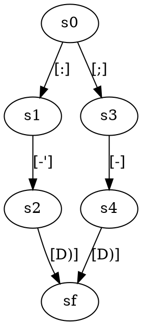

# AutomatonAPI
AutomatonAPI currently only supports reading and parsing files, and accepting inputs.
More features may be upcoming.

Note that this API is completely open source and reusable.

## Installing AutomatonAPI as JAR Library `v.1.0`
[Download](https://github.com/Leeniiux/automaton/tree/main/jar) and install AutomatonAPI's jar file as a library on your project.

## How to use AutomatonAPI

#### Summary
- [Parsing a file](#parsing-a-file-as-an-automaton)
- [Using an AutomatonBuilder](#using-an-automatonbuilder-to-create-an-automaton)
- [Creating a .dot file](#lets-have-an-example-of-an-automaton-as-a-dot-file-yourfiledot)
- [Exporting as a file](#)
- [Performing actions on an Automaton](#how-to-perform-actions-on-your-automaton)

#### Parsing a file as an Automaton
```java
public static void main(String[] args) {
  Automaton automaton = Parser.fromFile("yourfile.dot");
}
```

#### Using an AutomatonBuilder to create an Automaton
```java
public static void main(String[] args) {
  //Creating a builder and setting its name
  AutomatonBuilder automatonBuilder = new AutomatonBuilder();
  automatonBuilder.setName("NAME");
  
  //Creating both initial and final state (Final states might be plural)
  State initialState = automatonBuilder.createState("s0");
  State finalState = automatonBuilder.createState("sf");
  
  //Adding transitions to our states in order to link them one to another
  initialState.addTransition("[0-9]", finalState);
  
  //Defining our initial and final states as so in our builder
  automatonBuilder.setInit("s0");
  automatonBuilder.addFinal("sf");
  
  //Eventually building our Automaton
  Automaton automaton = automatonBuilder.build();
}
```

#### Let's have an example of an Automaton as a .dot file *('yourfile.dot')*


#### Exporting an Automaton as a file
```java
public static void main(String[] args) {
  //Initialization of an automaton
  Automaton automaton = Parser.fromFile("yourfile.dot");
  
  //Exporting without overriding an already existing file
  automaton.export("pathtomyfile.dot");
  
  //Overriding an already existing file
  automaton.export("pathtomyfile.dot", true);
}
```

#### How to perform actions on your Automaton
```java
public static void main(String[] args) {
  Automaton automaton = Parser.fromFile("yourfile.dot");
  
  //Running and acceptance test with an input string
  automaton.accepts(":-)"); // This will return true
  automaton.accepts(";')"); // This will return false
  automaton.accepts(";-"); // This will also return false
}
```
